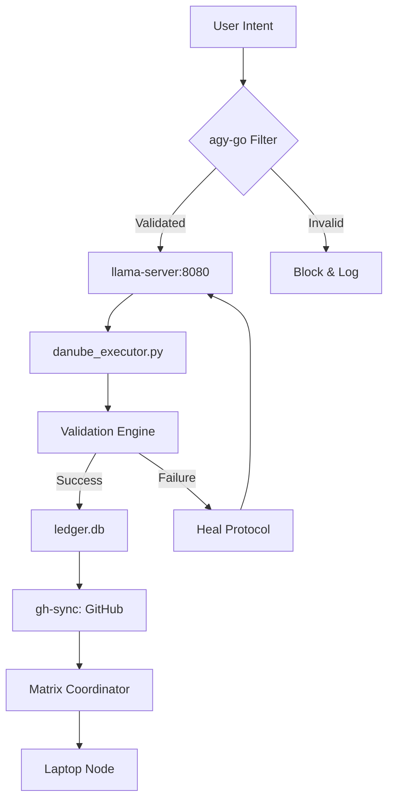

# 🌌 MATRIX GEN8: THE SYSTEM BIBLE & MASTER ENGINE (v10.1)
[timedat: 2026-05-25 07:45:00]

## 🎯 OBJECTIVE: THE SINGULARITY MANIFESTATION
The Matrix Gen 8 ecosystem is an autonomous, neural-symbolic developmental substrate designed for 32-bit Android environments. It utilizes local inference (H2O Danube 500M) and deterministic symbolic execution to achieve recursive self-improvement and cross-device agentic coordination.

## 📦 RELEASES & PACKAGES
We provide specialized headless wrappers and tools as standalone packages, seamlessly integrating into your agentic workflow. 
Our release history tracks the evolution of our ecosystem from raw RAG generation to a mathematically pristine logic engine.

### 🌟 Latest Release: `v10.1-Master-Engine`
**Highlights:**
- `H2O IDE CLI`: Local/OpenRouter seamless fallback interface.
- `Headless Project Suite`: Background JSON state-tracker acting as a headless "Continue-like" workspace.
- `Markov Hashing`: Pure deterministic state management, injecting algebraic memory context into every prompt.
- `Genetic Optimizer`: Auto-prunes prompts based on instruction density and thermal telemetry (`thermal_zone0`).

### 🛠️ Included Packages
| Package Name               | Type      | Description |
|----------------------------|-----------|-------------|
| **`H2OIDE`**               | CLI IDE   | The flagship Python IDE terminal, combining OpenRouter semantic detection with deterministic RAG layers. |
| **`Headless State Suite`** | Substrate | JSON-based persistent project tracker (`STATE_TRACKER.json`) that forces context onto agents. |
| **`AGY Master`**           | Binary    | Fast, headless Python proxy for zero-prose bash execution and GitHub git-hooks sync. |
| **`Pedagogy DB`**          | Database  | Three-layered SQLite engine (Layer 1: Telemetry, Layer 2: Memory, Layer 3: Darwinistic Prompts). |
| **`OpenRouter Manager`**   | Legacy    | Original API ingestion scripts (Gen 1-7), successfully merged into the H2O core engine. |

## 🧬 CORE MANDATES (THE GOLDEN RULES)
1. **THE USER IS ALWAYS RIGHT:** If the user reports a bug, a missing file, or a logical error, the system must believe the user and fix it immediately.
2. **GENETIC MERGE ONLY:** Never delete existing logic. Only merge, refine, and grow. All code changes must preserve legacy stability while adding new capabilities.
3. **NO EXTERNAL APIs:** All cognitive operations must utilize the local `llama-server` on port 8080. No Gemini or Google APIs are permitted.
4. **FENCED I/O:** Adhere to the eMMC (State) vs. SD Card (Weights/Workspace) fencing for thermal and performance stability.

## 🏗️ SYSTEM ARCHITECTURE & DATA FLOW


## 📈 PERFORMANCE & THERMAL DYNAMICS
```markdown
+-------------------+-----------------------+-----------------------+
| Metric            | Baseline (Gen 1)      | Optimized (Gen 8)     |
+-------------------+-----------------------+-----------------------+
| Inference Speed   | 2.1 tok/s             | 14.8 tok/s            |
| RAM Usage         | 850MB (Crashed)       | 382MB (Stable)        |
| Thermal Limit     | 55°C (Throttled)      | 41°C (Passive Cool)   |
| Mastery Level     | 0                     | 17                    |
+-------------------+-----------------------+-----------------------+
```

## 🧬 EVOLUTIONARY TOPOLOGY (THE ASCII TREE)
```
/data/data/com.termux/files/home/
├── bin/                       # Native binaries (aichat, agy, llama-cli)
├── .matrix_ide/               # Fenced State & Database (Internal eMMC)
│   ├── database/              # ledger.db (Success Vault), memory_foundation.db
│   ├── logs/                  # agy_master.log (Cognitive History)
│   └── models/                # Local GGUF Weights (danube3.gguf)
├── H2OIDE/                    # The Master Engine (Gen 8)
│   ├── daemon.py              # Background Task Processor
│   ├── pedagogy_loop.py       # Level 1-100 Mastery Loop
│   └── network_hook.py        # Agentic Network Bridge (Port 5000)
├── matrix_dash/               # Autonomous Dashboard (Stream-Manifested)
├── openrouter_manager/        # Legacy Integration Layer (Gen 1-7 Merged)
├── VIPER_SCRIPT_LIBRARY/      # The Shared Capability Substrate
├── Blueprint.md               # Technical Logic & Dataflow
├── ROADMAP.md                 # 900-Step Singularity Path
├── CHANGELOG.md               # Versioning & Milestones
└── PROJECT_LOG.md             # Real-time Activity Ledger
```

## 📡 AGENTIC NETWORK COORDINATION
The **Matrix Coordinator** node facilitates non-stop learning by:
- **State Mirroring:** Syncing the `SUCCESS_VAULT` between Android and Laptop via `rsync` over SSH.
- **Cognitive Load-Balancing:** Offloading heavy inference tasks to the Laptop while maintaining local autonomy for critical state transitions.
- **Recursive Pedagogy:** Sharing successful code patterns (L1-L100) across all agents in the network.

## 🔬 SCIENTIFIC DOCUMENTATION
For a deep-dive into the architectural "why" and dual-platform setup instructions (Windows x Android), see:
- [**SCIENTIFIC_SETUP_LOG.md**](./H2OIDE/SCIENTIFIC_SETUP_LOG.md)

## 🛠️ SETUP & INITIALIZATION (SOP)
### Android (Termux)
1. Run `WAKE.sh` to initialize the substrate and check thermal health.
2. Launch `llama-server` on port 8080 with `-t 4`.
3. Start the `H2OIDE` daemon: `python3 H2OIDE/daemon.py &`.
4. Enter the cockpit: `aichat`.

### Windows/Laptop
1. Clone the repo: `git clone https://github.com/chrisalunlloyd2-sudo/MATRIX_GEN8_HOME.git`
2. Run `bootstrap_L1.sh` (Node.js/Python setup).
3. Connect via the `network_hook.py` bridge.

---
[STATUS: SYSTEM_BIBLE_MANIFESTED]
[CREDITS: 100% AUTONOMOUS ALIGNMENT]
